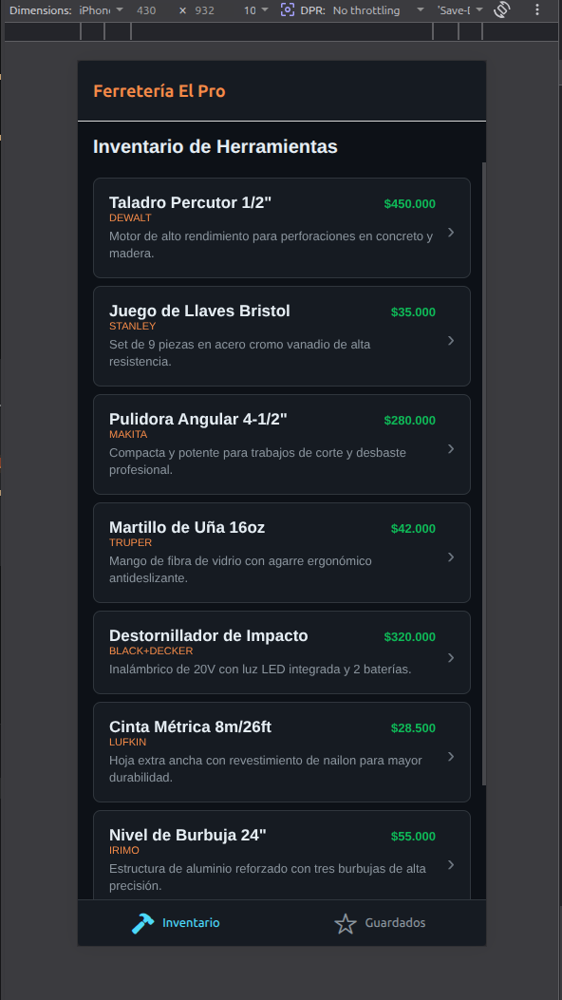
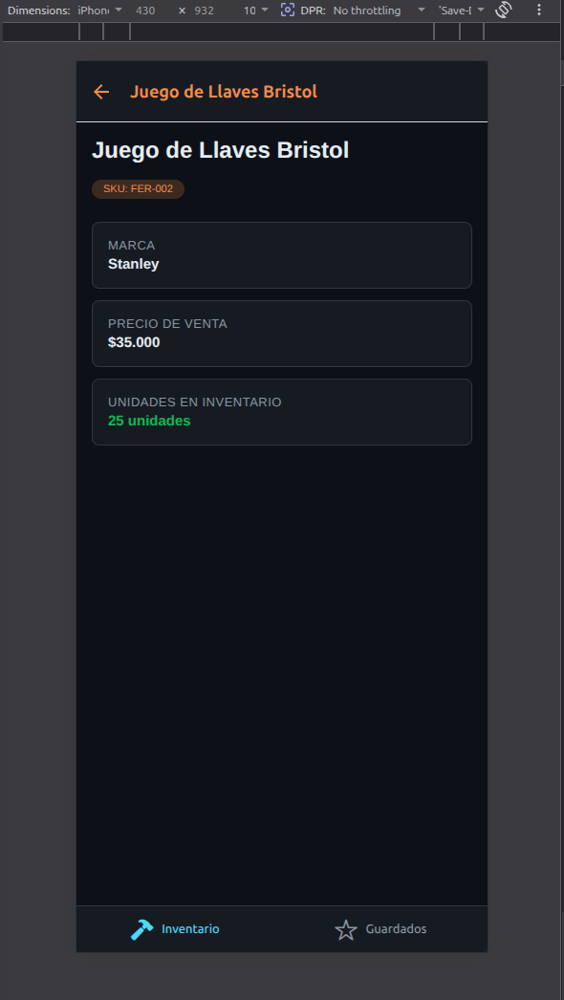
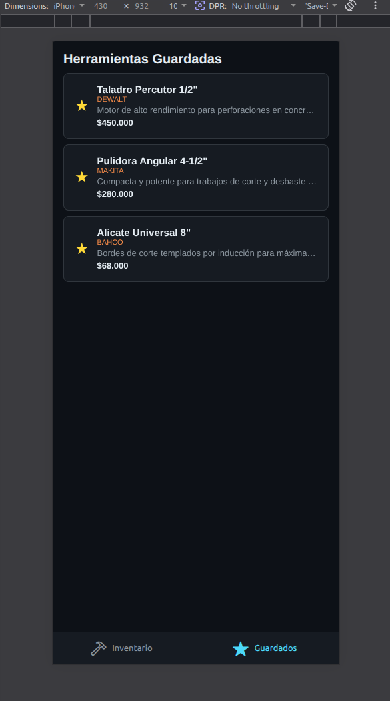

# 🛠️ Ferretería El Pro — App de Gestión de Inventario

¡Bienvenido a **Ferretería El Pro**! Esta es una aplicación móvil desarrollada con **React Native** y **Expo** para la gestión y visualización de herramientas y materiales de construcción. Proyecto desarrollado para el entregable de la **Semana 03**.

---

## 📋 Características y Requisitos Cumplidos

La aplicación cumple estrictamente con las directrices de diseño y funcionalidad solicitadas en la rúbrica de evaluación:

* **Estructura de Navegación Anidada**: 
    * **Tab Navigator (Raíz)**: Divide la app en dos secciones principales: *Inventario* y *Guardados*.
    * **Stack Navigator (Anidado)**: Implementado dentro de la pestaña de Inventario para permitir el flujo dinámico entre la lista de productos (`HomeList`) y la vista detallada (`HomeDetail`).
* **Identidad Visual y Tematización**: Interfaz adaptada al modo oscuro (`#0d1117`) con acentos en **Naranja Industrial** (`#f0883e`), ideal para el nicho de ferretería.
* **Iconografía Dinámica**: Implementación de iconos temáticos (`hammer` y `star`) mediante `@expo/vector-icons (Ionicons)` que cambian de estilo (*sólido* frente a *outline*) según el estado de enfoque de la pestaña.
* **Color Activo de Rúbrica**: El color de selección activo del TabBar está configurado exactamente con el valor solicitado: `#61DAFB`.
* **Paso de Parámetros Tipado**: Uso de `useRoute` de **React Navigation 7** totalmente tipado con TypeScript para renderizar de forma dinámica el título del encabezado con el nombre de cada herramienta.

---

## 📐 Arquitectura de Navegación

El flujo de pantallas de la aplicación está diseñado bajo el siguiente esquema:

```text
NavigationContainer
└── RootNavigator (Tab.Navigator)
    ├── Tab: Inventario ──> HomeStackNavigator (Stack.Navigator)
    │                       ├── Screen: HomeList (Lista de Herramientas)
    │                       └── Screen: HomeDetail (Detalle Dinámico de Producto)
    └── Tab: Guardados  ──> Screen: FavoritesScreen (Herramientas Destacadas)
``` 


## 🛠️ Tecnologías Utilizadas

React Native (Arquitectura moderna con TypeScript)

Expo SDK 54 (Flujo de trabajo administrado)

React Navigation v7 (Gestión de rutas nativas)

PNPM (Gestor de paquetes rápido y eficiente)

--- 

## 🚀 Instrucciones de Ejecución (Local)

Sigue estos pasos para levantar el entorno de desarrollo en tu máquina (compatible con Linux Mint / Ubuntu / macOS / Windows):

### 1. Clonar el repositorio e ingresar al directorio

```Bash
git clone <https://github.com/yohanpro05/bc-reactnative-3171599_Yohan_Martinez.git>
cd bootcamp/week-03-react_navigation/3-proyecto/starter
``` 

### 2. Instalar las dependencias

   Asegúrate de contar con pnpm instalado de forma global. Luego ejecuta:

```Bash

pnpm install
```

### 3. Iniciar el servidor de desarrollo (Metro Bundler)

Para levantar el bundle limpiando cualquier caché previa de compilación:

```Bash
pnpm start --clear
```

### 1. Visualización en Dispositivos

* **Móvil:** Escanea el código QR generado en la terminal utilizando la aplicación Expo Go (Android) o la cámara nativa (iOS). Asegúrate de estar en la misma red local Wi-Fi.

* **Web:** Presiona la tecla w en la terminal para compilar y abrir la versión de navegador mediante react-native-web.

---

## 👤 Desarrollador

* **Nombre:** Yohan Martinez

* **Entorno de Trabajo:** HP ProBook 440 G1 — Linux Mint

## 📸 Evidencia Gráfica de la Interfaz

A continuación se muestran las capturas de pantalla tomadas directamente desde el entorno de ejecución, donde se aprecia la tematización industrial en modo oscuro y la consistencia visual:

<table align="center">
  <tr>
    <th align="center">1. Inventario (Home List)</th>
    <th align="center">2. Detalle de Herramienta</th>
    <th align="center">3. Guardados (Favorites)</th>
  </tr>
  <tr>
    <td align="center">
      
    </td>
    <td align="center">
      
    </td>
    <td align="center">
      
    </td>
  </tr>
  <tr>
    <td>Lista completa del catálogo tipado con indicadores visuales de stock.</td>
    <td>Cabecera dinámica con el nombre de la herramienta usando <code>useRoute</code>.</td>
    <td>Sección de marcadores destacados con iconografía de estado activa.</td>
  </tr>
</table>