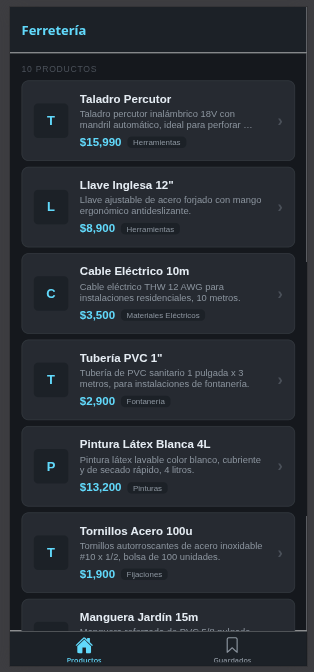
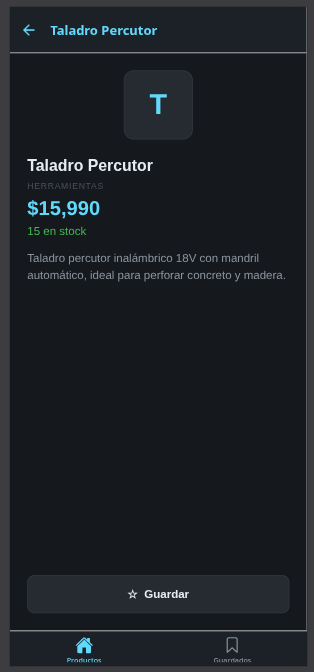
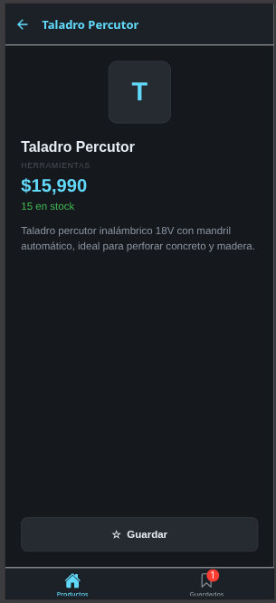
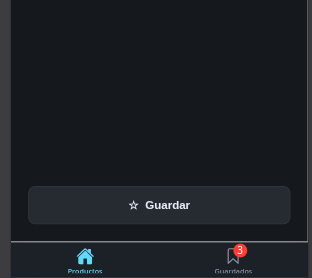
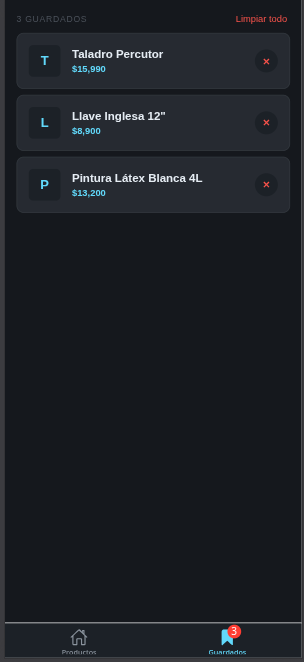
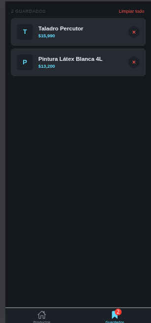
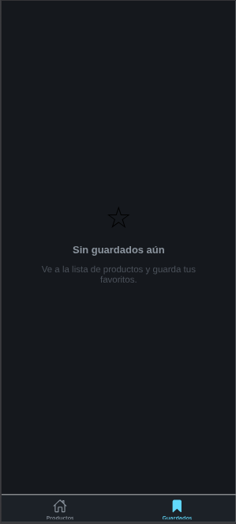

# Semana 04 — Estado Global con Zustand

**Dominio**: Ferretería

## Descripción

App móvil con navegación por tabs y estado global gestionado con Zustand. Permite explorar productos de ferretería, ver su detalle y guardarlos en una lista de favoritos que persiste entre pantallas mediante un store compartido.

## Store Zustand: `useSavedStore`

- **`items`**: lista de productos guardados
- **`addItem(product)`**: agrega un producto (sin duplicados)
- **`removeItem(id)`**: elimina por id
- **`clearAll()`**: vacía la lista
- **`isItemSaved(id)`**: helper para el botón Guardar/Quitar

Los selectores se usan individualmente en cada componente para evitar re-renders innecesarios.

## Navegación

- **Tab Navigator** con dos pestañas: `Productos` y `Guardados`
- **Stack anidado** en Productos: `HomeList` → `HomeDetail`
- **Badge dinámico** en el tab Guardados que refleja el conteo del store

## Screenshots

| # | Pantalla |
|---|----------|
| 1 |  |
| 2 |  |
| 3 |  |
| 4 |  |
| 5 |  |
| 6 |  |
| 7 |  |

## Tecnologías

- Expo SDK 54
- React Native 0.81
- Zustand 5
- React Navigation 7 (Bottom Tabs + Native Stack)
- TypeScript

## Ejecutar

```bash
cd starter
npx expo start --clear
```

Apretar `w` para web o escanear QR con Expo Go.
