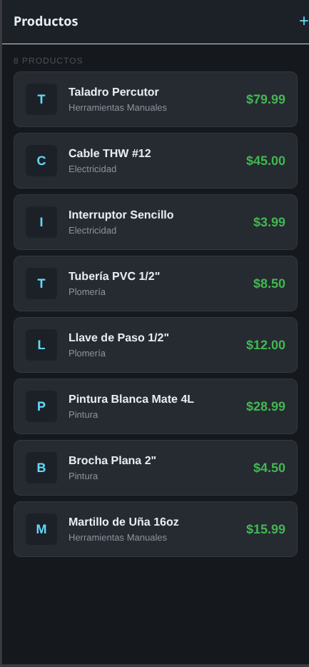
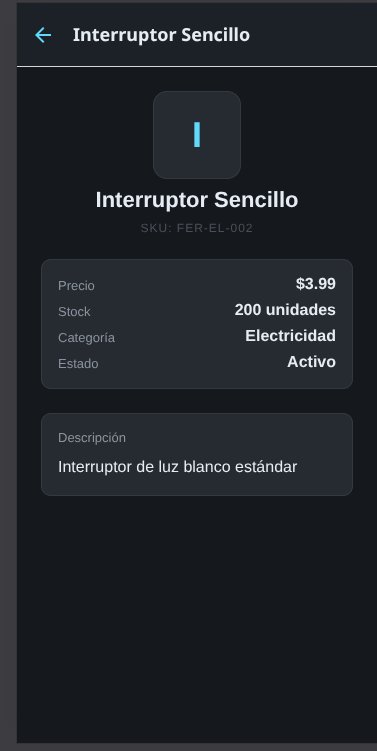
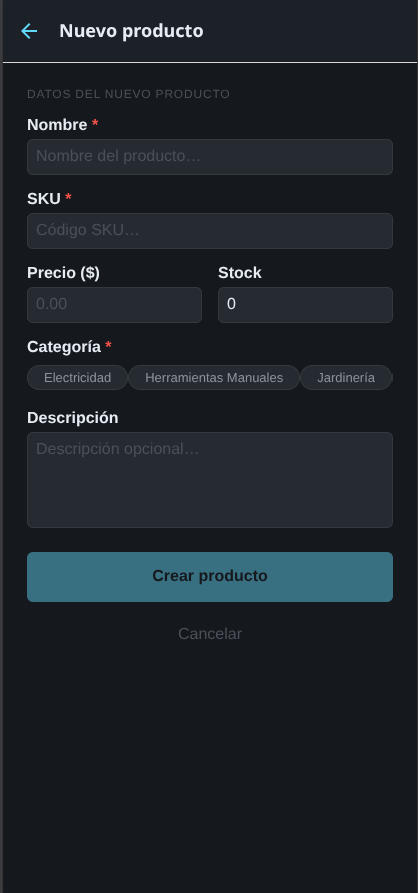
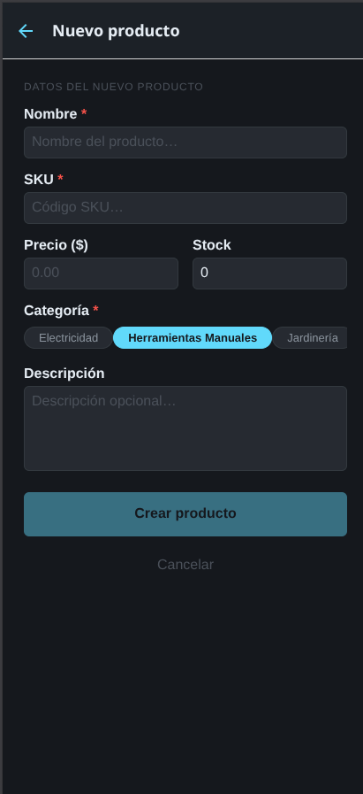
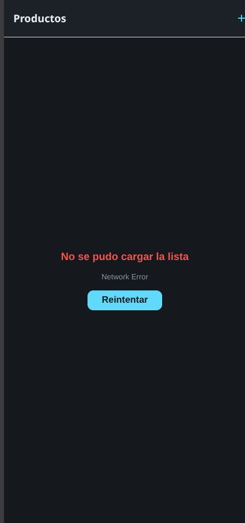
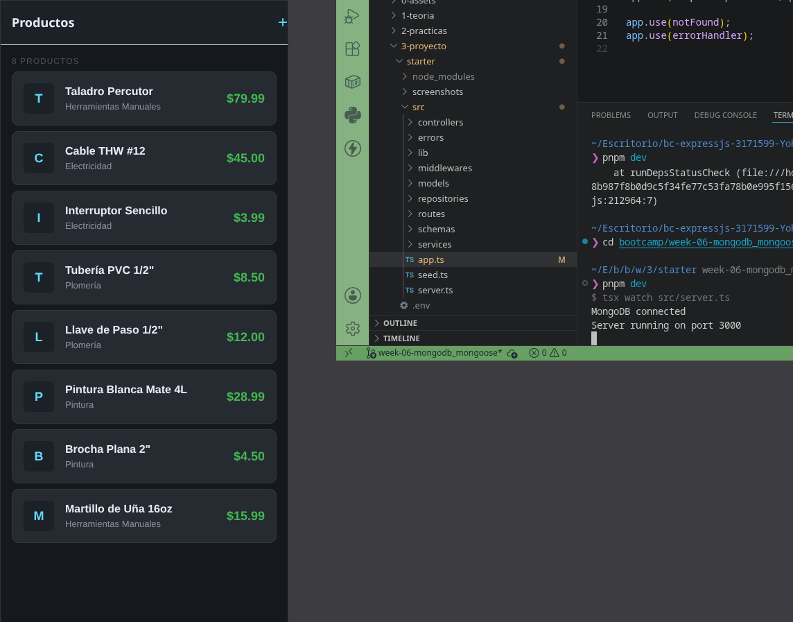

# Semana 05 — Networking y TanStack Query v5

**Dominio**: Ferretería

## Descripción

App que consume una API REST real usando Axios y TanStack Query v5. Permite listar productos de ferretería desde la API Express (MongoDB), ver su detalle y crear nuevos productos mediante un formulario.

## API

```
http://192.168.1.12:3000/api/v1
```

| Endpoint | Método | Descripción |
|----------|--------|-------------|
| `/products` | GET | Lista paginada de productos |
| `/products/:id` | GET | Detalle de un producto |
| `/products` | POST | Crear un nuevo producto |
| `/categories` | GET | Lista de categorías |

## Hooks

- **`useProducts()`** — `useQuery` que obtiene la lista con caching y staleTime de 2 min
- **`useProductById(id)`** — `useQuery` para detalle individual (solo corre si hay id)
- **`useCreateProduct()`** — `useMutation` con `invalidateQueries` en `onSuccess`
- **`useCategories()`** — `useQuery` para poblar el selector de categorías

## Screens

| Pantalla | Funcionalidad |
|----------|---------------|
| **HomeScreen** | FlatList con datos reales, pull-to-refresh, loading/error/empty states |
| **DetailScreen** | ScrollView con precio, stock, categoría, estado, descripción |
| **CreateScreen** | Formulario con nombre, SKU, precio, stock, categoría (chips), descripción |

## Screenshots

| # | Pantalla |
|---|----------|
| 1 |  |
| 2 |  |
| 3 |  |
| 4 |  |
| 5 |  |
| 6 |  |

## Tecnologías

- Expo SDK 54
- React Native 0.81
- TanStack Query v5
- Axios
- React Navigation 7 (Native Stack)
- TypeScript

## Ejecutar

```bash
cd starter
pnpm install
npx expo start --clear
```

Apretar `w` para web o escanear QR con Expo Go. Asegurarse que la API Express esté corriendo en `http://192.168.1.12:3000`.
