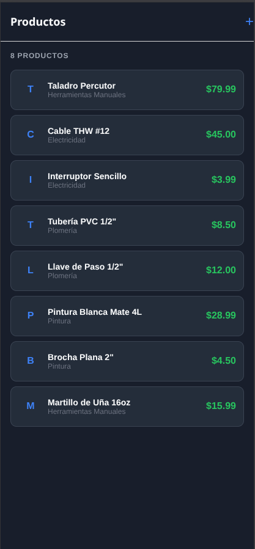
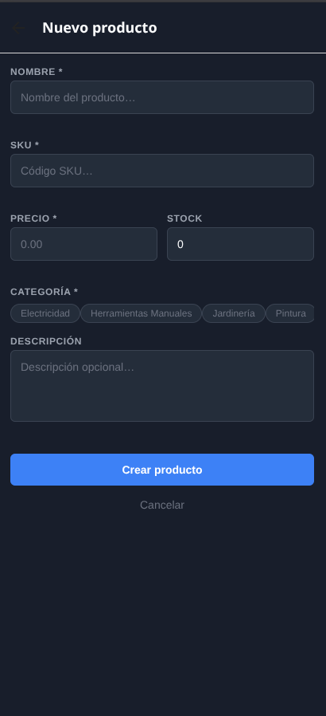
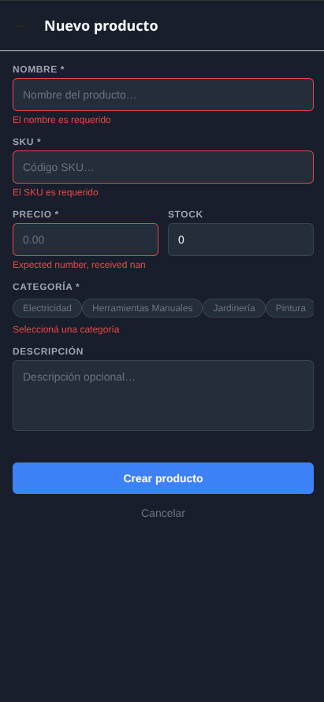
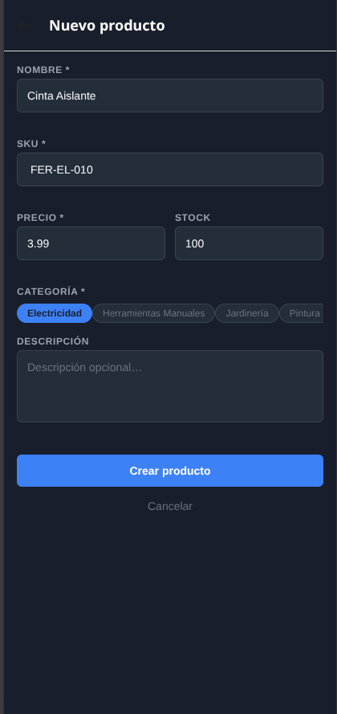
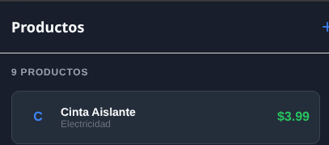
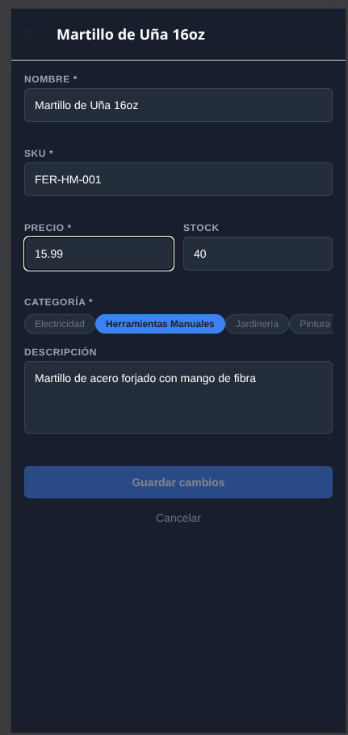
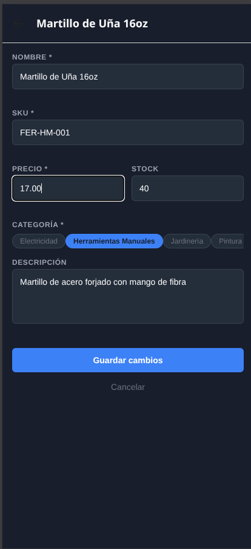

# Semana 06 — Formularios con React Hook Form + Zod

**Dominio**: Ferretería

## Descripción

App con formularios Create y Edit con validación Zod aplicados al dominio de ferretería. Usa React Hook Form + `@hookform/resolvers` para manejar estados, validación en tiempo real y reset de formularios.

## Schema Zod (`productSchema`)

```typescript
name:        z.string().min(1).max(150)
description: z.string().max(500).optional()
price:       z.coerce.number().positive()
stock:       z.coerce.number().int().min(0)
sku:         z.string().min(1).max(50)
category:    z.string().min(1)
```

## Componentes

- **`FormField`** — Componente genérico reutilizable que encapsula `Controller` + `TextInput` + mensaje de error. Usado en Create y Edit.

## Pantallas

| Pantalla | Funcionalidad |
|----------|---------------|
| **HomeScreen** | Lista de productos con navegación a Edit |
| **CreateScreen** | Formulario con RHF + Zod + categorías en chips + `useCreateItem` |
| **EditScreen** | Carga datos con `useItemById`, `reset()` en useEffect, guarda con `useUpdateItem` |

## Hooks

- `useItems()` — lista
- `useItemById(id)` — detalle (para Edit)
- `useCreateItem()` — mutation con `invalidateQueries`
- `useUpdateItem()` — mutation con PUT, invalida lista e ítem individual
- `useCategories()` — categorías para el selector

## Screenshots

| # | Pantalla |
|---|----------|
| 1 |  |
| 2 |  |
| 3 |  |
| 4 |  |
| 5 |  |
| 6 |  |
| 7 |  |

## Tecnologías

- Expo SDK 54
- React Native 0.81
- React Hook Form + Zod
- TanStack Query v5
- Axios
- React Navigation 7
- TypeScript

## Ejecutar

```bash
cd starter
pnpm install
npx expo start --clear
```

Apretar `w` para web. API Express en `http://192.168.1.12:3000/api/v1`.
